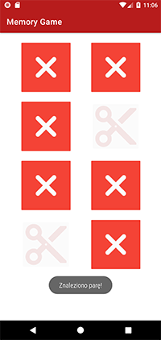

# MemoryGame_Android

Memory game for android to check your memory and have some fun

* [Informacje wstępne](#Informacjewstępne)
* [Interfejs](#Interfejs)
* [Kod](#Kod)

## Informacje wstępne

Przedmiot: Programowanie aplikacji mobilnych

Rok akademicki: 2020/2021

Grupa: S22-32

Skład zespołu: Aleksandra Okrój, Natalia Skórowska 

IDE: Android Studio

Język: Kotlin

Nazwa aplikacji: Memory Game

Cel aplikacji:

Aplikacja „Memory Game”, to gra polegająca na odkrywaniu obrazków umieszczonych na planszy tak aby znaleźć parę identycznych ikon. Składa się ona z dwóch ekranów: ekranu startowego oraz ekranu zawierającego główną planszę z grą. 

## Interfejs

Ekran początkowy: 

Ekran z planszą gry: 

 
 
 Widok po znalezieniu pary takich samych obrazków:
 

 
 Widok po klinięciu w już odkrytą kartę:
 
 
 
 ## Kod 
Opis realizacji projektu:
  
Deklaracja zmiennej, a następnie pobranie widoku button - przycisku odpowiadającego za przejście z ekranu startowego do ekranu z główną plansza gry i stworzenie funkcji openActivity2, która realizuje tą funkcjonalność.

 
 
 
 Utworzenie list z 8 przycisków, a także 8 obrazków z planszy:

 
 
 Stworzenie listy, ze stworzonych wcześniej 4 ikon. Dodanie wszystkich elementów z listy po raz kolejny, w celu stworzenia par, a następnie za pomocą funkcji shuffle() wymieszanie ich ułożenia.
 
 
 
 Pobranie indeksu (pozycji) obrazków.
 
  
  
  Stworzenie klasy MemoryCard , która informuje nas o stanie danej karty, o tym czy jest obrócona obrazkiem do dołu
  czy odkryta oraz czy znaleziono parę. Na początku gry obie z tych flag przyjmują wartość false dla każdego przycisku.
  
 
    
  Stworzenie funkcji UpdateViews(), która, jeśli użytkownik znajdzię parę takich samych obrazków, zmniejszy ich widoczność na planszy.
    
 
    
   Jeśli użytkownik kliknie po raz kolejny na kartę, która już została odkryta pojawi się komunikat informujący o błędnym ruchu:
    

  Rozpatrzenie 3 możliwych w trakcie gry przypadków:
- 0 kart odkrytych wcześniej na planszy (nie licząc już znalezionych par) = przewróć naciśniętą kartę
- 1 karta odkryta wcześniej = obróć naciśniętą kartę i sprawdź czy stanowi ona parę z poprzednią
- 2 karty odkryte wcześniej = przewróć kartę

  
  Stworzenie funkcji checkForMatch, która sprawdza czy dwie odkryte karty są identyczne. 
I dodanie komunikatu, który informuje użytkownika o odnalezieniu pary.

  Jeśli nie znaleziono pary po odkryciu 2 obrazków, obróć ponownie do dołu wszystkie karty.

  
  
 
 
